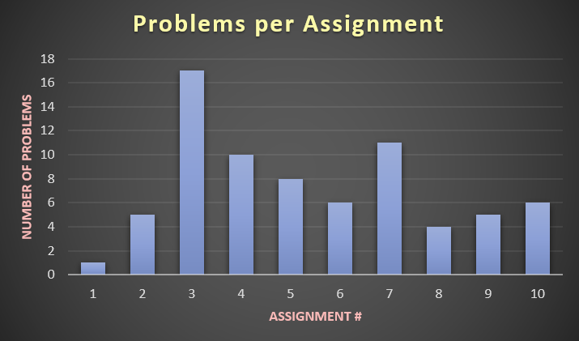

## Assignments and Graphs

#### By Michael Petrarca

### Assignments

#### Assignment 1 (Introduction to R)

\- [Assignment 1](Assignment-1.html)

#### Assignment 2 (R Basics: Operations on Vectors)

\- [Assignment 2](assignment2.html)

#### Assignment 3 (Data Wrangling with Base R)

\- [Assignment 3](assignment3.html)

#### Assignment 4 (Data Wrangling with dplr)

\- [Assignment 4](assignment4.html)

#### Assignment 5 (Handling Missing Values)

\- [Assignment 5](assignment5.html)

#### Assignment 6 (Visualization: Aesthetic Mapping)

\- [Assignment 6](assignment6.html)

#### Assignment 7 (Visualization: Some aspects of ggplot2)

\- [Assignment 7](assignment7.html)

#### Assignment 8 (Animated Graphics: Bar Races)

\- [Assignment 8](Assingment8.html)

#### Assignment 9 (Animated Graphics: Time Revealing)

\- [Assignment 9](assignment9.html)

#### Assignment 10 (Modeling: Basics)

\- [Assignment 10](Assignment10.html)

#### Assignment 11 (Predictive Modeling: Basics)

\- [Assignment 11](assignment11.html)

#### Assignment 12 (Modeling: Tuning)

\- [Assignment 12](assignment12.html)

#### Assignment 13 (Text Mining)

\- [Assignment 13](assignment13.html)

#### Assignment 14 (Text Mining - Reddit)

\- [Assignment 14](assignment_14.html)

#### Assignment 15 (Functions: If-Else Statement)

\- [Assignment 15](assignment15.html)

### Extra Credit Assignments

\- [Assignment 4 Extra Credits](assignment4_extra_credits.html)

\- [Assignment 5 Extra Credits](assignment5_extra_credits.html)

\- [Assignment 7 Extra Credits](assignment7_extra_credits.html)

\- [Assignment 9 Extra Credits](Assignment_9_Extra_Credits.html)

\- [Assignment 14 Extra Credits](assignment14_extra.html)

### Plots

\- [Assignment 7 Plot](billionaires.png)

### Midterm

\- [Midterm](MP_Math_421_Midterm.html)

### Midterm Presentation

\- [Midterm Presentation](MidtermPresentation.html)
